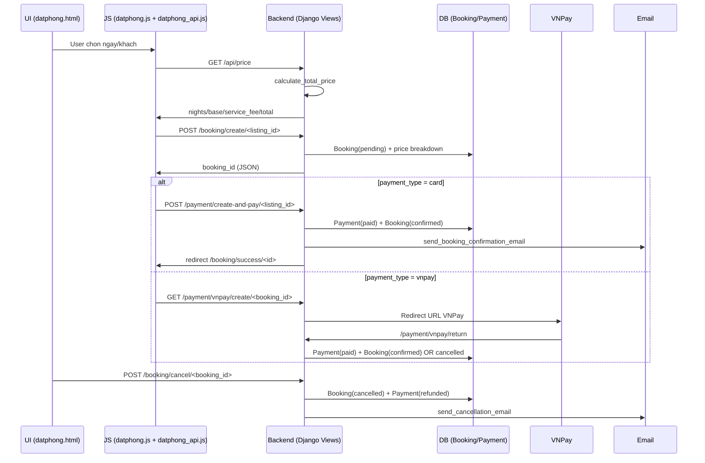

# Booking - Payment Flow (chi tiet)

Tai lieu nay mo ta flow chon phong, chon ngay/khach, tinh tien, kiem tra lich trung, thanh toan (mock + VNPay), gui email thanh cong, va huy dat phong. Noi dung duoc trich tu code hien tai trong repo.

## 0) Cac thanh phan chinh (DB + Backend + UI)

### DB Models
- `app/models.py::Listing`
  - truong lien quan: `price_per_night`, `max_adults`, `is_active`
- `app/models.py::Booking`
  - `check_in`, `check_out`, `guests`, `base_price`, `service_fee`, `total_price`, `booking_status`
- `app/models.py::Payment`
  - `booking` (OneToOne), `method`, `amount`, `status`, `paid_at`, `transaction_id`, `details`

### Backend (Views / APIs)
- Dat phong + kiem tra trung:
  - `app/views/book_view.py::create_booking`
- Tinh tien + thanh toan:
  - `app/views/payment_views.py::calculate_total_price`
  - `app/views/payment_views.py::create_booking_and_pay`
  - `app/views/payment_views.py::vnpay_create`
  - `app/views/payment_views.py::vnpay_return`
  - `app/views/payment_views.py::vnpay_ipn`
- API tinh gia:
  - `app/views/admin_api.py::listing_price`
- API kiem tra lich (standalone):
  - `app/views/availability_views.py::check_availability`

### UI (Templates + JS)
- Dat phong page:
  - `app/templates/app/guest/datphong.html`
  - `app/static/app/js/datphong.js`
  - `app/static/app/js/datphong_api.js`
- Booking success:
  - `app/templates/app/guest/booking_success.html`
  - `app/views/booking_success_view.py::booking_success`
- Lich su booking:
  - `app/templates/app/user/user_booking_history.html`
  - `app/views/user_booking_history_view.py::user_booking_history`

---

## 1) Flow tong quan (sequence)



---

## 2) Chi tiet tung buoc

### Buoc A - Chon phong va vao trang dat phong
- URL: `/datphong/?room=<listing_id>&checkin=YYYY-MM-DD&checkout=YYYY-MM-DD&guests=...`
- View: `app/views/__init__.py::datphong`
  - Load `Listing`, anh chinh, dia chi, rating, price_per_night.
- Template: `app/templates/app/guest/datphong.html`
  - Render thong tin listing.
  - Gan `data-listing-id` tren `<body>`.

### Buoc B - Chon ngay/khach (UI)
- JS: `app/static/app/js/datphong.js`
  - `openDateModal()`, `saveDates()`, `openGuestsModal()`, `saveGuests()`
  - Cap nhat `#tripDates`, `#reviewDates`, `#numNights`.
- JS: `app/static/app/js/datphong_api.js`
  - `calculatePrice()` goi backend de tinh gia dong.

### Buoc C - Tinh tien (backend)
- Endpoint: `GET /api/price/?listing=<id>&checkin=...&checkout=...&guests=...`
- View: `app/views/admin_api.py::listing_price`
  - Parse input.
  - Goi `calculate_total_price()`.
- Logic tinh gia: `app/views/payment_views.py::calculate_total_price`
  - `base = price_per_night * nights`
  - `service_fee = SERVICE_FEE_FIXED (neu co) hoac 10%`
  - `taxes = 0`
  - `total = base + service_fee`

### Buoc D - Kiem tra lich trung
Co 2 phan:
1) API check availability (doc lap)
- Endpoint: `GET /api/check-availability/?listing=<id>&checkin=...&checkout=...`
- View: `app/views/availability_views.py::check_availability`
  - Query `Booking` (exclude cancelled), kiem tra overlap.

2) Kiem tra trong create booking (bat buoc)
- `app/views/book_view.py::create_booking`
- `app/views/payment_views.py::create_booking_and_pay`
  - Dung `select_for_update()` + check overlap.

### Buoc E - Tao booking pending (chua thanh toan)
- Trigger: user bam nut "Xac nhan va thanh toan"
- JS: `app/static/app/js/datphong.js`
  - `POST /booking/create/<listing_id>/`
- View: `app/views/book_view.py::create_booking`
  - Validate ngay/guest/listing active.
  - Check trung lich.
  - Tao hoac cap nhat `Booking` voi:
    - `booking_status='pending'`
    - `base_price`, `service_fee`, `total_price`
  - Tra JSON `{ booking_id }`.

### Buoc F - Thanh toan (mock card)
- JS: `app/static/app/js/datphong.js`
  - `POST /payment/create-and-pay/<listing_id>/`
- View: `app/views/payment_views.py::create_booking_and_pay`
  - Tinh gia lai
  - Check trung lich
  - Tao/cap nhat `Payment`:
    - `method='card'`, `status='paid'`, `paid_at=now`
  - Set `Booking.booking_status='confirmed'`
  - Goi `send_booking_confirmation_email()`
  - Tra JSON `redirect` -> `/booking/success/<id>`

### Buoc G - Thanh toan VNPay
- JS: `app/static/app/js/datphong.js`
  - `GET /payment/vnpay/create/<booking_id>/`
- View: `app/views/payment_views.py::vnpay_create`
  - Tao URL VNPay (sandbox) tu `VNPAY_*` settings.
- VNPay return:
  - URL: `/payment/vnpay/return/`
  - View: `app/views/payment_views.py::vnpay_return`
    - Verify signature
    - Neu thanh cong: Payment(paid, method='vnpay'), Booking(confirmed)
    - Neu that bai: Booking(cancelled), Payment(cancelled)
- IPN:
  - `/payment/vnpay/ipn/` -> `app/views/payment_views.py::vnpay_ipn`

### Buoc H - Hien thi booking thanh cong
- URL: `/booking/success/<booking_id>/`
- View: `app/views/booking_success_view.py::booking_success`
  - Load booking + payment.
  - Gui email neu payment paid.
- Template: `app/templates/app/guest/booking_success.html`

### Buoc I - Huy booking + hoan tien
- UI: `app/templates/app/user/user_booking_history.html`
- POST: `/booking/cancel/<booking_id>/`
- View: `app/views/book_view.py::cancel_booking`
  - `Booking.booking_status='cancelled'`
  - Neu Payment paid -> `status='refunded'`
  - Gui email huy (`send_cancellation_email`)

### Buoc J - Auto update trang thai theo thoi gian
- Command: `app/management/commands/expire_pending_bookings.py`
  - pending -> cancelled (qua TTL)
  - confirmed -> in_progress
  - in_progress -> completed

---

## 3) Endpoints va mapping nhanh

```
GET  /datphong/?room=...                         -> views.datphong (app/views/__init__.py)
GET  /api/price/?listing=...&checkin=...         -> admin_api.listing_price
GET  /api/check-availability/?listing=...        -> availability_views.check_availability
POST /booking/create/<listing_id>/              -> book_view.create_booking
POST /payment/create-and-pay/<listing_id>/       -> payment_views.create_booking_and_pay
GET  /payment/vnpay/create/<booking_id>/         -> payment_views.vnpay_create
GET  /payment/vnpay/return/                      -> payment_views.vnpay_return
GET  /payment/vnpay/ipn/                         -> payment_views.vnpay_ipn
POST /booking/cancel/<booking_id>/               -> book_view.cancel_booking
GET  /booking/success/<booking_id>/              -> booking_success_view.booking_success
```

---

## 4) Trang thai Booking / Payment (de doc code de hon)

### Booking.booking_status
- pending: tao booking, chua thanh toan
- confirmed: thanh toan thanh cong
- cancelled: huy / thanh toan that bai
- in_progress, completed: duoc cap nhat boi command

### Payment.status
- paid: thanh toan thanh cong
- refunded: hoan tien
- failed: that bai

---

## 5) File can doc theo thu tu
1) `app/templates/app/guest/datphong.html`
2) `app/static/app/js/datphong.js`
3) `app/static/app/js/datphong_api.js`
4) `app/views/admin_api.py::listing_price`
5) `app/views/payment_views.py::calculate_total_price`
6) `app/views/book_view.py::create_booking`
7) `app/views/payment_views.py::create_booking_and_pay`
8) `app/views/payment_views.py::vnpay_*`
9) `app/views/booking_success_view.py::booking_success`
10) `app/views/book_view.py::cancel_booking`

---

## 6) Ghi chu ky thuat (can luu y khi doc)
- `payment_start.html` khong co trong `app/templates/app/pages/` (flow non-AJAX co the gap loi).
- `Payment.status` su dung gia tri `cancelled` trong code, nhung choices trong model chua co.
- Code su dung `available_from/available_to` tren Listing, can kiem tra model hien tai co field nay chua.

```
